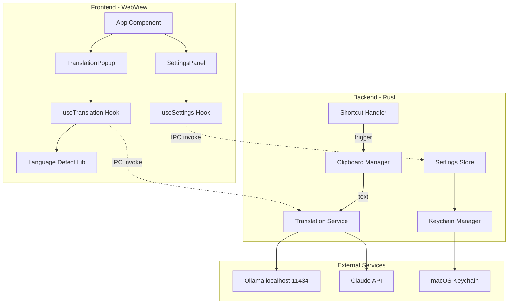
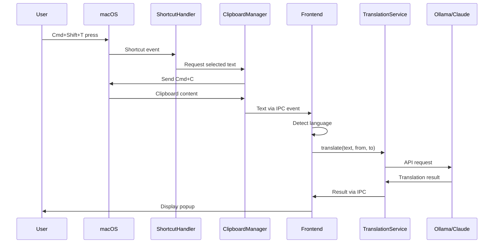
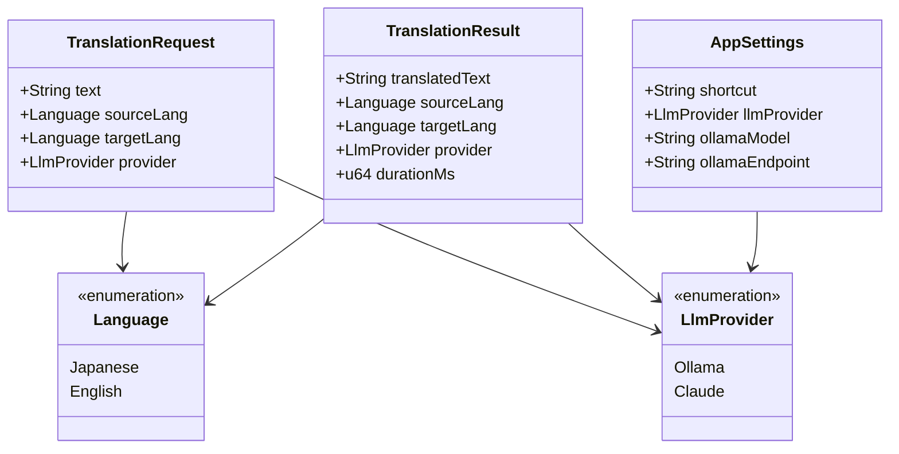

# Technical Design Document: AI Translation Desktop

## Overview

**Purpose**: 本機能は、macOSユーザーがグローバルショートカットキー一つで任意のアプリケーションから選択テキストを即座に翻訳できるデスクトップアプリケーションを提供する。

**Users**: 開発者、翻訳者、一般macOSユーザーが、英語ドキュメントの理解、テキスト翻訳作業、オフライン翻訳に活用する。

**Impact**: 従来のコピー→翻訳サイト→ペーストのワークフローを、ショートカット一発の操作に置き換え、作業効率を大幅に向上させる。

### Goals

- グローバルショートカット（Cmd+Shift+T）でシステム全体から翻訳を起動可能にする
- 日本語↔英語の双方向自動翻訳を実現する
- Ollama（ローカル）とClaude API（リモート）の切り替えによるプライバシー/精度のトレードオフを提供する
- 50MB以下の軽量アプリ、3秒以内の翻訳完了を達成する

### Non-Goals

- 韓国語対応（将来フェーズ）
- 翻訳履歴の保存・検索機能
- システムトレイ常駐
- 複数候補の翻訳表示
- 音声読み上げ機能

## Architecture

### Architecture Pattern & Boundary Map

Tauri v2のハイブリッドアーキテクチャを採用。Rustバックエンドがシステム操作（ショートカット、クリップボード、LLM通信）を担当し、React/TypeScriptフロントエンドがUIレンダリングを担当する。



**Architecture Integration**:
- **Selected pattern**: Tauri Hybrid（ステアリングで決定済み）
- **Domain/feature boundaries**: Frontend（UI表示）、Backend（システム操作・外部通信）で責務を明確に分離
- **Existing patterns preserved**: React Hooks パターン、Tauri IPC パターン
- **New components rationale**: 各コンポーネントは単一責任原則に従い、テスト可能性を確保
- **Steering compliance**: tech.md で定義されたTauri v2 + React + TypeScript構成に準拠

### Technology Stack

| Layer | Choice / Version | Role in Feature | Notes |
|-------|------------------|-----------------|-------|
| Frontend | React 18 + TypeScript 5.x | UI描画、状態管理 | Tauri公式サポート |
| Backend | Rust 1.77+ / Tauri 2.x | システム操作、API通信 | 軽量バイナリ生成 |
| Styling | Tailwind CSS 3.x | ポップアップUI スタイリング | ユーティリティファースト |
| HTTP Client | reqwest 0.12 | LLM API通信 | 非同期、TLS対応 |
| Data Storage | tauri-plugin-store 2.x | 設定永続化 | JSONベース |
| Secrets | security-framework | APIキー保存 | macOS Keychain |

## System Flows

### Main Translation Flow



**Key Decisions**:
- ショートカット検出後、RustがCmd+Cを送信してクリップボード経由でテキスト取得
- 言語検出はフロントエンドで実行（LLM呼び出し削減）
- 翻訳処理はバックエンドで実行（APIキー保護）

## Requirements Traceability

| Requirement | Summary | Components | Interfaces | Flows |
|-------------|---------|------------|------------|-------|
| 1.1-1.5 | グローバルショートカット | ShortcutHandler | ShortcutService | Main Translation Flow |
| 2.1-2.4 | 選択テキスト取得 | ClipboardManager | ClipboardService | Main Translation Flow |
| 3.1-3.5 | 言語自動検出 | languageDetect | detectLanguage() | Main Translation Flow |
| 4.1-4.6 | 翻訳処理 | TranslationService | TranslationService | Main Translation Flow |
| 5.1-5.7 | ポップアップ表示 | TranslationPopup | Props | Main Translation Flow |
| 6.1-6.4 | クリップボードコピー | TranslationPopup | onCopy() | - |
| 7.1-7.5 | LLM切り替え | SettingsPanel, TranslationService | SettingsService | - |
| 8.1-8.7 | 設定管理 | SettingsPanel, SettingsStore, KeychainManager | SettingsService | - |
| 9.1-9.8 | 非機能要件 | 全コンポーネント | - | - |

## Components and Interfaces

### Component Summary

| Component | Domain/Layer | Intent | Req Coverage | Key Dependencies | Contracts |
|-----------|--------------|--------|--------------|------------------|-----------|
| ShortcutHandler | Backend/System | グローバルショートカット監視 | 1.1-1.5 | tauri-plugin-global-shortcut (P0) | Service |
| ClipboardManager | Backend/System | クリップボード操作 | 2.1-2.4 | tauri-plugin-clipboard-manager (P0) | Service |
| TranslationService | Backend/Service | LLM翻訳実行 | 4.1-4.6, 7.1-7.5 | reqwest (P0), SettingsStore (P1) | Service |
| SettingsStore | Backend/Data | 設定永続化 | 8.1-8.7 | tauri-plugin-store (P0) | Service |
| KeychainManager | Backend/Security | APIキー管理 | 8.7, 9.4 | security-framework (P0) | Service |
| TranslationPopup | Frontend/UI | 翻訳結果表示 | 5.1-5.7, 6.1-6.4 | useTranslation (P0) | State |
| SettingsPanel | Frontend/UI | 設定画面 | 8.3-8.6 | useSettings (P0) | State |
| useTranslation | Frontend/Hook | 翻訳ロジック | 3.1-3.5, 4.1-4.6 | languageDetect (P1) | Service |
| useSettings | Frontend/Hook | 設定ロジック | 8.1-8.2 | - | Service |
| languageDetect | Frontend/Lib | 言語検出 | 3.1-3.5 | - | - |

### Backend Layer

#### ShortcutHandler

| Field | Detail |
|-------|--------|
| Intent | システム全体のグローバルショートカットを監視し、翻訳フローをトリガーする |
| Requirements | 1.1, 1.2, 1.3, 1.4, 1.5 |

**Responsibilities & Constraints**
- グローバルショートカット（デフォルト: Cmd+Shift+T）の登録と監視
- ショートカット競合の検出と通知
- アクセシビリティ権限の確認

**Dependencies**
- External: tauri-plugin-global-shortcut — ショートカット登録 (P0)
- External: tauri-plugin-macos-permissions — 権限確認 (P0)
- Outbound: ClipboardManager — テキスト取得トリガー (P0)

**Contracts**: Service [x]

##### Service Interface

```rust
pub trait ShortcutService {
    /// グローバルショートカットを登録
    fn register_shortcut(&self, shortcut: &str) -> Result<(), ShortcutError>;

    /// ショートカット登録を解除
    fn unregister_shortcut(&self, shortcut: &str) -> Result<(), ShortcutError>;

    /// ショートカットが登録済みか確認
    fn is_registered(&self, shortcut: &str) -> bool;

    /// アクセシビリティ権限を確認
    fn check_accessibility_permission(&self) -> bool;

    /// アクセシビリティ権限をリクエスト
    fn request_accessibility_permission(&self) -> Result<(), PermissionError>;
}

#[derive(Debug, thiserror::Error)]
pub enum ShortcutError {
    #[error("Shortcut already registered by another application")]
    AlreadyRegistered,
    #[error("Invalid shortcut format: {0}")]
    InvalidFormat(String),
    #[error("Registration failed: {0}")]
    RegistrationFailed(String),
}
```

**Implementation Notes**
- Integration: Tauri setupでプラグイン初期化、`with_handler`でイベントコールバック設定
- Validation: ショートカット文字列のフォーマット検証（Modifiers + Key）
- Risks: 他アプリとの競合は事前検出不可、ユーザー通知で対応

---

#### ClipboardManager

| Field | Detail |
|-------|--------|
| Intent | クリップボード経由で選択テキストを取得し、元の内容を復元する |
| Requirements | 2.1, 2.2, 2.3, 2.4 |

**Responsibilities & Constraints**
- Cmd+Cキーストロークの送信
- クリップボード内容の読み取り
- 元のクリップボード内容の保存と復元

**Dependencies**
- External: tauri-plugin-clipboard-manager — クリップボード操作 (P0)
- External: macOS Accessibility API — キーストローク送信 (P0)

**Contracts**: Service [x]

##### Service Interface

```rust
pub trait ClipboardService {
    /// 選択テキストを取得（Cmd+C送信 → クリップボード読み取り）
    async fn get_selected_text(&self) -> Result<String, ClipboardError>;

    /// クリップボードにテキストを書き込み
    async fn write_text(&self, text: &str) -> Result<(), ClipboardError>;

    /// クリップボード内容を読み取り
    async fn read_text(&self) -> Result<Option<String>, ClipboardError>;
}

#[derive(Debug, thiserror::Error)]
pub enum ClipboardError {
    #[error("No text selected or clipboard empty")]
    EmptyClipboard,
    #[error("Clipboard contains non-text data")]
    NonTextContent,
    #[error("Clipboard operation failed: {0}")]
    OperationFailed(String),
}
```

**Implementation Notes**
- Integration: `get_selected_text`は内部で元のクリップボード保存→Cmd+C送信→読み取り→復元を実行
- Validation: 空文字列やnon-textコンテンツのチェック
- Risks: Cmd+C送信のタイミング（100ms遅延で対応）

---

#### TranslationService

| Field | Detail |
|-------|--------|
| Intent | Ollama/Claude APIを使用してテキスト翻訳を実行する |
| Requirements | 4.1, 4.2, 4.3, 4.4, 4.5, 4.6, 7.1, 7.2, 7.3, 7.4, 7.5 |

**Responsibilities & Constraints**
- LLMプロバイダー（Ollama/Claude）の選択と切り替え
- 翻訳プロンプトの構築
- タイムアウト処理（10秒）
- 翻訳結果からの不要テキスト除去

**Dependencies**
- External: reqwest — HTTP通信 (P0)
- Inbound: SettingsStore — LLM設定取得 (P1)
- Inbound: KeychainManager — Claude APIキー取得 (P1)

**Contracts**: Service [x]

##### Service Interface

```rust
pub trait TranslationService {
    /// テキストを翻訳
    async fn translate(
        &self,
        text: &str,
        source_lang: Language,
        target_lang: Language,
    ) -> Result<TranslationResult, TranslationError>;

    /// LLMプロバイダーの接続状態を確認
    async fn check_provider_status(&self, provider: LlmProvider) -> ProviderStatus;
}

#[derive(Debug, Clone)]
pub struct TranslationResult {
    pub translated_text: String,
    pub source_lang: Language,
    pub target_lang: Language,
    pub provider: LlmProvider,
    pub duration_ms: u64,
}

#[derive(Debug, Clone, Copy, PartialEq, Eq)]
pub enum Language {
    Japanese,
    English,
}

#[derive(Debug, Clone, Copy, PartialEq, Eq)]
pub enum LlmProvider {
    Ollama,
    Claude,
}

#[derive(Debug)]
pub enum ProviderStatus {
    Available,
    Unavailable { reason: String },
}

#[derive(Debug, thiserror::Error)]
pub enum TranslationError {
    #[error("Translation request timed out")]
    Timeout,
    #[error("Connection failed: {0}")]
    ConnectionFailed(String),
    #[error("API error: {0}")]
    ApiError(String),
    #[error("Invalid API key")]
    InvalidApiKey,
}
```

**Implementation Notes**
- Integration: Ollamaは`localhost:11434/api/chat`、Claudeは`api.anthropic.com/v1/messages`
- Validation: レスポンスから翻訳結果のみを抽出（LLMの前置き除去）
- Risks: Ollamaモデル未ダウンロード時のエラーハンドリング

---

#### SettingsStore

| Field | Detail |
|-------|--------|
| Intent | アプリケーション設定を永続化する |
| Requirements | 8.1, 8.2, 8.3, 8.4, 8.5, 8.6 |

**Responsibilities & Constraints**
- JSON形式での設定保存
- アプリ起動時の設定読み込み
- デフォルト値の提供

**Dependencies**
- External: tauri-plugin-store — JSON永続化 (P0)

**Contracts**: Service [x]

##### Service Interface

```rust
pub trait SettingsService {
    /// 設定を取得
    fn get_settings(&self) -> AppSettings;

    /// 設定を保存
    fn save_settings(&self, settings: &AppSettings) -> Result<(), SettingsError>;

    /// 設定をリセット
    fn reset_to_defaults(&self) -> Result<(), SettingsError>;
}

#[derive(Debug, Clone, Serialize, Deserialize)]
pub struct AppSettings {
    pub shortcut: String,
    pub llm_provider: LlmProvider,
    pub ollama_model: String,
    pub ollama_endpoint: String,
}

impl Default for AppSettings {
    fn default() -> Self {
        Self {
            shortcut: "CommandOrControl+Shift+T".to_string(),
            llm_provider: LlmProvider::Ollama,
            ollama_model: "qwen2.5:3b".to_string(),
            ollama_endpoint: "http://localhost:11434".to_string(),
        }
    }
}
```

---

#### KeychainManager

| Field | Detail |
|-------|--------|
| Intent | Claude APIキーをmacOS Keychainに安全に保存・取得する |
| Requirements | 8.7, 9.4 |

**Responsibilities & Constraints**
- Keychainへのパスワード保存
- Keychainからのパスワード取得
- 署名要件への対応

**Dependencies**
- External: security-framework — Keychainアクセス (P0)

**Contracts**: Service [x]

##### Service Interface

```rust
pub trait KeychainService {
    /// APIキーを保存
    fn save_api_key(&self, service: &str, account: &str, key: &str) -> Result<(), KeychainError>;

    /// APIキーを取得
    fn get_api_key(&self, service: &str, account: &str) -> Result<Option<String>, KeychainError>;

    /// APIキーを削除
    fn delete_api_key(&self, service: &str, account: &str) -> Result<(), KeychainError>;
}

#[derive(Debug, thiserror::Error)]
pub enum KeychainError {
    #[error("Keychain access denied")]
    AccessDenied,
    #[error("Item not found")]
    NotFound,
    #[error("Keychain operation failed: {0}")]
    OperationFailed(String),
}
```

**Implementation Notes**
- Integration: service名は"com.honnyaku.translation", accountは"claude_api_key"
- Risks: 開発時（未署名アプリ）はKeychain制限あり、フォールバックとして環境変数を検討

---

### Frontend Layer

#### TranslationPopup

| Field | Detail |
|-------|--------|
| Intent | 翻訳結果をフローティングポップアップで表示する |
| Requirements | 5.1, 5.2, 5.3, 5.4, 5.5, 5.6, 5.7, 6.1, 6.2, 6.3, 6.4 |

**Responsibilities & Constraints**
- カーソル位置近くにポップアップ表示
- ローディング状態の表示
- 翻訳結果の表示
- コピーボタンとフィードバック

**Dependencies**
- Inbound: useTranslation — 翻訳状態とアクション (P0)

**Contracts**: State [x]

##### State Management

```typescript
interface TranslationPopupProps {
  isVisible: boolean;
  isLoading: boolean;
  originalText: string;
  translatedText: string | null;
  error: string | null;
  position: { x: number; y: number };
  onCopy: () => void;
  onClose: () => void;
}

interface TranslationPopupState {
  isCopied: boolean;
}
```

**Implementation Notes**
- Integration: Tauri window APIで`always_on_top`, `decorations: false`, `skip_taskbar: true`を設定
- Validation: position境界チェック（画面外表示防止）

---

#### SettingsPanel

| Field | Detail |
|-------|--------|
| Intent | アプリケーション設定UIを提供する |
| Requirements | 8.3, 8.4, 8.5, 8.6 |

**Responsibilities & Constraints**
- ショートカットキー設定
- LLMプロバイダー選択
- Claude APIキー入力
- Ollamaモデル設定

**Dependencies**
- Inbound: useSettings — 設定状態とアクション (P0)

**Contracts**: State [x]

##### State Management

```typescript
interface SettingsPanelProps {
  settings: AppSettings;
  providerStatus: ProviderStatus;
  onSave: (settings: AppSettings) => Promise<void>;
  onTestConnection: (provider: LlmProvider) => Promise<ProviderStatus>;
}

interface AppSettings {
  shortcut: string;
  llmProvider: 'ollama' | 'claude';
  ollamaModel: string;
  ollamaEndpoint: string;
  claudeApiKey: string; // マスク表示、保存時はKeychain経由
}
```

---

#### useTranslation Hook

| Field | Detail |
|-------|--------|
| Intent | 翻訳ロジックとUI状態を管理する |
| Requirements | 3.1, 3.2, 3.3, 3.4, 3.5, 4.1 |

**Responsibilities & Constraints**
- 言語検出の実行
- 翻訳リクエストの発行（IPC経由）
- 翻訳状態の管理

**Dependencies**
- Outbound: TranslationService — IPC invoke (P0)
- Inbound: languageDetect — 言語判定 (P1)

**Contracts**: Service [x]

##### Service Interface

```typescript
interface UseTranslationReturn {
  isLoading: boolean;
  originalText: string;
  translatedText: string | null;
  error: string | null;
  translate: (text: string) => Promise<void>;
  reset: () => void;
}

function useTranslation(): UseTranslationReturn;
```

---

#### languageDetect

| Field | Detail |
|-------|--------|
| Intent | テキストの言語を判定する |
| Requirements | 3.1, 3.4, 3.5 |

**Responsibilities & Constraints**
- 日本語/英語の判定
- 短いテキストでの推測

**Contracts**: なし（純粋関数）

```typescript
type Language = 'ja' | 'en';

interface DetectionResult {
  language: Language;
  confidence: number; // 0.0 - 1.0
}

function detectLanguage(text: string): DetectionResult;
```

**Implementation Notes**
- ひらがな（\u3040-\u309F）、カタカナ（\u30A0-\u30FF）、漢字（\u4E00-\u9FFF）の存在で日本語判定
- confidence < 0.5 の場合はデフォルト（日→英）を使用

## Data Models

### Domain Model



### Logical Data Model

**Settings Store (JSON)**:
```json
{
  "shortcut": "CommandOrControl+Shift+T",
  "llm_provider": "ollama",
  "ollama_model": "qwen2.5:3b",
  "ollama_endpoint": "http://localhost:11434"
}
```

**Keychain Entry**:
- Service: `com.honnyaku.translation`
- Account: `claude_api_key`
- Value: (encrypted API key)

## Error Handling

### Error Strategy

各レイヤーで型安全なエラーハンドリングを実装。RustはResult型、TypeScriptはUnion型を使用。

### Error Categories and Responses

**User Errors (4xx equivalent)**:
- 空のクリップボード → 「翻訳するテキストが選択されていません」
- 無効なAPIキー → 「APIキーが無効です。設定を確認してください」

**System Errors (5xx equivalent)**:
- Ollama未起動 → 「Ollamaが起動していません。起動するか、Claude APIに切り替えてください」
- ネットワークエラー → 「接続に失敗しました。ネットワーク設定を確認してください」
- タイムアウト → 「翻訳がタイムアウトしました。再試行してください」

**Business Logic Errors**:
- 言語検出失敗 → デフォルト方向（日→英）で翻訳を続行

### Monitoring

- エラー発生時はログ出力（APIキーはマスク）
- ユーザー向けエラーメッセージは日本語で表示

## Testing Strategy

### Unit Tests

- **languageDetect**: 日本語/英語判定の境界値テスト、短文テスト
- **TranslationService**: プロンプト構築、レスポンスパース、エラーハンドリング
- **SettingsStore**: 設定の読み書き、デフォルト値

### Integration Tests

- **Shortcut → Clipboard → Translation フロー**: E2Eでの翻訳フロー
- **Settings変更 → 翻訳プロバイダー切り替え**: 設定変更の即時反映
- **Keychain API統合**: APIキーの保存・取得

### E2E/UI Tests

- **ポップアップ表示・非表示**: Esc、クリック外での閉じる動作
- **コピーボタン動作**: クリップボードへのコピー
- **設定画面操作**: 各設定項目の変更と保存

## Security Considerations

- **APIキー保護**: Claude APIキーはmacOS Keychainに保存、環境変数やファイルに保存しない
- **通信暗号化**: Claude APIとの通信はHTTPS必須
- **権限管理**: アクセシビリティ権限は明示的にユーザーに説明しリクエスト
- **ログマスキング**: APIキーやセンシティブデータはログ出力時にマスク処理

## Performance & Scalability

- **翻訳速度**: ショートカット押下から結果表示まで3秒以内（Ollama）
- **メモリ使用量**: アイドル時100MB以下
- **アプリサイズ**: 50MB以下（Tauriの軽量性を活用）
- **起動時間**: アプリ起動から利用可能まで5秒以内
