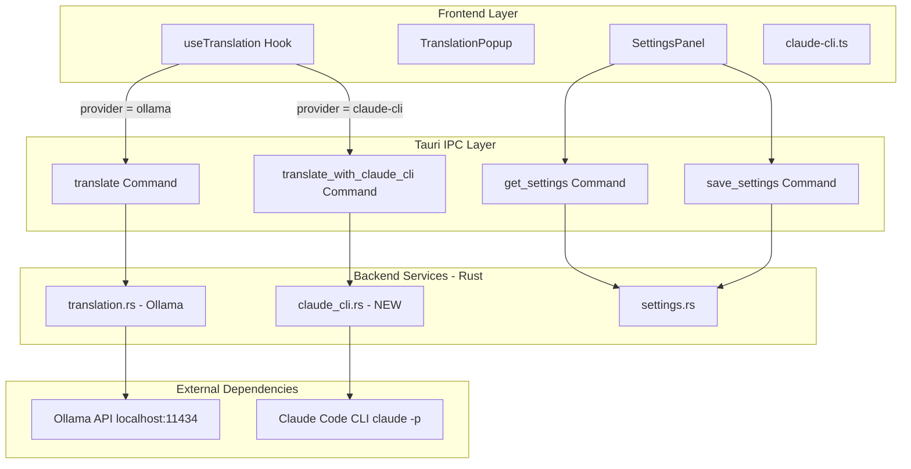
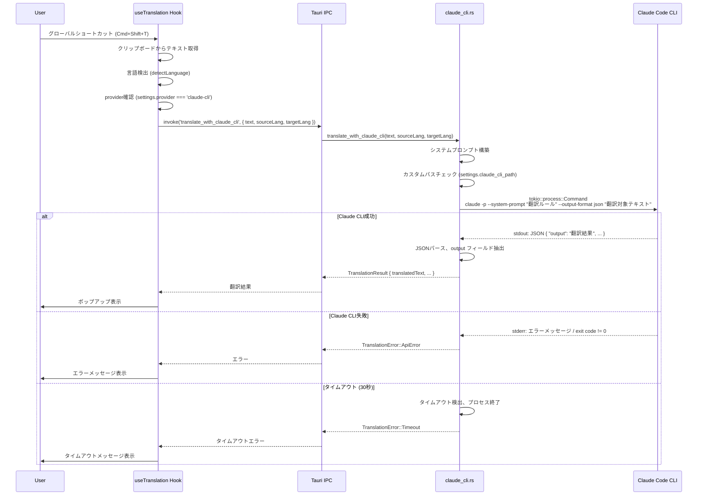
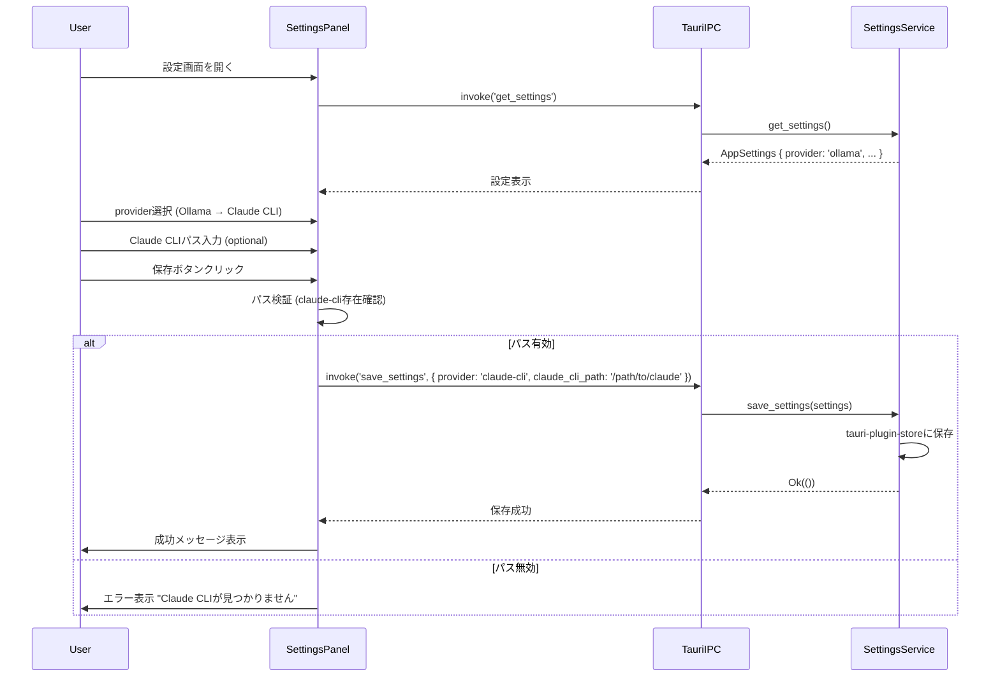

# Technical Design Document: Claude CLI Translation

## Overview

この機能は、Honnyaku翻訳アプリケーションに**Claude CLI (`claude -p`) 翻訳方式**を第3の選択肢として追加します。既存のOllama（ローカルLLM）翻訳機能を維持しつつ、Claude Codeの公式CLIツールを活用したプロフェッショナルな翻訳オプションを提供することで、ユーザーは用途・環境に応じて最適な翻訳方式を選択できるようになります。

**Purpose**: プロンプトキャッシングを活用したClaude CLI方式により、繰り返し翻訳時のコスト削減と応答速度向上を実現し、ユーザーに高品質な翻訳体験を提供します。

**Users**: macOSユーザー（開発者、翻訳作業者）が、選択したテキストをグローバルショートカット（Cmd+Shift+T）で即座に翻訳する際に、Ollama（プライバシー重視）またはClaude CLI（高精度）を選択できます。

**Impact**: 現在のOllama専用アプリから、複数翻訳方式をサポートするマルチプロバイダー翻訳アプリへと進化します。

### Goals

- Claude Code CLI（`claude -p`）を使った非対話型翻訳機能の実装
- 設定UIで3つの翻訳方式（Ollama、Claude API（将来）、Claude CLI）から選択可能にする
- プロンプトキャッシングを活用したコスト削減と応答速度向上
- 既存のOllama翻訳機能に影響を与えず、後方互換性を維持
- Claude CLIパスのカスタマイズ対応（標準パスにない場合）

### Non-Goals

- Claude API（HTTP直接呼び出し）の実装は本機能の範囲外（将来的な拡張として考慮）
- 翻訳方式の自動選択・推薦機能（ユーザーが手動で選択）
- プロンプトキャッシングの詳細な最適化やA/Bテスト（基本実装のみ）
- 他OS（Windows、Linux）への対応（macOS専用を維持）

## Architecture

### Existing Architecture Analysis

**現在のアーキテクチャ（Ollama専用）**:

```
┌─────────────────────────────────────┐
│     Frontend (React/TypeScript)     │
│   useTranslation hook → Tauri IPC  │
├─────────────────────────────────────┤
│           Tauri IPC Layer           │
│        translate コマンド            │
├─────────────────────────────────────┤
│     Backend (Rust)                  │
│   translate_with_ollama サービス     │
├─────────────────────────────────────┤
│    Ollama (localhost:11434)         │
└─────────────────────────────────────┘
```

**既存パターンと制約**:
- `useTranslation` hook: Tauri IPC `translate`コマンドを呼び出し、言語検出はフロントエンド側で実行
- `AppSettings`: `shortcut`, `ollama_model`, `ollama_endpoint`のみ（provider選択なし）
- Rust非同期処理: `tokio`ランタイム使用、`reqwest`でHTTP呼び出し
- 設定永続化: `tauri-plugin-store`（JSONファイル）

**技術的制約**:
- macOS専用（グローバルショートカット、クリップボード操作）
- Tauri v2、React 18、Rust 1.70+
- 既存テストを全てパスする必要がある（回帰防止）

### Architecture Pattern & Boundary Map

**選択パターン**: **Hybrid Approach（ハイブリッド方式）**



**Architecture Integration**:
- **選択パターン**: Hybrid（既存コンポーネント拡張 + 新規サービス作成）
- **Domain/Feature境界**:
  - **Frontend**: `useTranslation` hookでprovider分岐ロジック（Strategy Pattern）
  - **Backend**: provider毎に独立したサービス（`claude_cli.rs`新規作成）
  - **Settings**: `AppSettings`構造体を拡張（`provider`, `claude_cli_path`追加）
- **既存パターン保持**:
  - Tauri IPCコマンド定義パターン（`lib.rs`）
  - 非同期処理パターン（`tokio::process::Command`）
  - エラーハンドリング（`thiserror`による型付きエラー）
- **新規コンポーネント根拠**:
  - `claude_cli.rs`: Claude CLI実行ロジックを独立させ、テスト容易性を確保
  - `claude-cli.ts`: フロントエンドクライアントとして、Tauri IPC呼び出しをカプセル化
- **Steering準拠**: Tauri v2標準構成、フロントエンド/バックエンド分離、feature-first組織化

### Technology Stack

| Layer | Choice / Version | Role in Feature | Notes |
|-------|------------------|-----------------|-------|
| **Frontend** | TypeScript 5.9.3 | 型安全なprovider選択ロジック、Claude CLIクライアント実装 | 既存: strict mode有効、`any`型禁止 |
| **Frontend** | React 18 | UI更新（SettingsPanel拡張、provider選択UI） | 既存: hooks中心の実装パターン |
| **Frontend** | @tauri-apps/api 2.x | Tauri IPC通信（`translate_with_claude_cli`コマンド呼び出し） | 既存: `invoke()`パターン使用 |
| **Backend** | Rust 1.70+ | Claude CLI実行、プロセス管理、エラーハンドリング | 既存: `tokio`非同期ランタイム |
| **Backend** | tokio 1.x | 非同期プロセス実行（`tokio::process::Command`） | 既存パターンと一貫性 |
| **Backend** | serde 1.x | AppSettings拡張のシリアライズ/デシリアライズ | 既存: `#[serde(rename_all = "camelCase")]` |
| **Backend** | tauri-plugin-store 2.x | provider設定、Claude CLIパス設定の永続化 | 既存: JSON形式で保存 |
| **Infrastructure** | Claude Code CLI (latest) | 翻訳実行エンジン（`claude -p`コマンド） | **新規依存**: ユーザーがインストール必要 |

**Rationale**:
- **Claude Code CLI選択理由**: 公式ツール、プロンプトキャッシング自動対応、`-p`フラグで非対話型実行が可能
- **tokio::process::Command選択理由**: 既存の非同期パターンと一貫性、Tauriランタイムとの親和性
- **AppSettings拡張アプローチ**: 既存の設定管理パターンを踏襲、下位互換性を維持（Option型で新フィールド追加）

より詳細な技術選定の背景は`research.md`の「Research Log」セクションを参照。

## System Flows

### 翻訳実行フロー（Claude CLI方式）



**Key Decisions**:
- **非同期実行**: `tokio::process::Command`でブロッキングを回避
- **タイムアウト設定**: 30秒でClaude CLI実行を強制終了、リソースリーク防止
- **構造化出力**: `--output-format json` を使用し、JSONパースで翻訳結果を確実に抽出
- **エラー区別**: Claude CLIの終了コードとstderrでエラー種別を判定
- **プロンプトキャッシング**: `--system-prompt` で設定した固定翻訳ルールをClaude APIがキャッシュ（自動処理）、繰り返し翻訳時のトークン消費を90%削減

### Provider選択と設定保存フロー



## Requirements Traceability

| 要件 | 概要 | コンポーネント | インターフェース | フロー |
|------|------|--------------|--------------|--------|
| 1.1, 1.2, 1.3, 1.4, 1.5, 1.6 | Claude CLI翻訳エンジン実装 | `claude_cli.rs`, `translate_with_claude_cli` | Service, TauriCommand | 翻訳実行フロー |
| 2.1, 2.2, 2.3, 2.4, 2.5 | 翻訳方式選択機能拡張 | `AppSettings`, `SettingsPanel`, `useTranslation` | Settings, UI | Provider選択フロー |
| 3.1, 3.2, 3.3, 3.4, 3.5, 3.6 | バックエンド統合（Rust） | `claude_cli.rs`, `lib.rs` | TauriCommand, Service | 翻訳実行フロー |
| 4.1, 4.2, 4.3, 4.4, 4.5, 4.6 | フロントエンド統合（TS） | `claude-cli.ts`, `useTranslation` | TauriClient, Hook | 翻訳実行フロー |
| 5.1, 5.2, 5.3, 5.4, 5.5 | Claude CLIパス設定 | `AppSettings`, `SettingsPanel` | Settings, UI | Provider選択フロー |
| 6.1, 6.2, 6.3, 6.4 | プロンプトキャッシング最適化 | `claude_cli.rs` (システムプロンプト構築) | Service | 翻訳実行フロー |
| 7.1, 7.2, 7.3, 7.4, 7.5 | エラーハンドリング | `TranslationError`, `TranslationPopup` | Error, UI | 翻訳実行フロー（エラー分岐） |
| 8.1, 8.2, 8.3, 8.4, 8.5 | 既存機能互換性維持 | 全コンポーネント | - | 既存Ollamaフローを変更しない |

## Components and Interfaces

### Summary

| Component | Domain/Layer | Intent | Req Coverage | Key Dependencies (P0/P1) | Contracts |
|-----------|--------------|--------|--------------|--------------------------|-----------|
| `llm/claude_cli.rs` | Backend/LLM | Claude CLI実行とプロセス管理 | 1, 3, 6, 7 | tokio (P0), ClaudeCLI (P0), serde_json (P0) | Service |
| `translate_with_claude_cli` | Backend/TauriCommand | Tauri IPCコマンド定義 | 3 | claude_cli.rs (P0) | API |
| `claude-cli.ts` | Frontend/Lib | Claude CLI翻訳クライアント | 4 | @tauri-apps/api (P0) | Service |
| `useTranslation` (拡張) | Frontend/Hook | Provider分岐ロジック追加 | 2, 4, 8 | claude-cli.ts (P1) | State |
| `AppSettings` (拡張) | Backend/Data | provider, claude_cli_path追加 | 2, 5 | serde (P0) | State |
| `SettingsPanel` (拡張) | Frontend/UI | Provider選択UI追加 | 2, 5 | useSettings (P0) | UI |

### Backend Services

#### `llm/claude_cli.rs` (新規作成)

| Field | Detail |
|-------|--------|
| **Location** | `/src-tauri/src/llm/claude_cli.rs` |
| Intent | Claude Code CLIを`tokio::process::Command`で非同期実行し、翻訳結果を取得 |
| Requirements | 1.1, 1.2, 1.3, 1.4, 1.5, 1.6, 3.1, 3.2, 3.3, 3.4, 3.5, 3.6, 6.1, 6.2, 6.3, 6.4 |

**Responsibilities & Constraints**:
- Claude CLIコマンドの構築（`-p`, `--system-prompt`引数）
- 非同期プロセス実行とタイムアウト管理（30秒）
- 標準出力/エラー出力のパース、Exit code検証
- システムプロンプトの構築（キャッシング最適化）
- カスタムCLIパスの優先使用（`claude_cli_path`設定）

**Dependencies**:
- **Inbound**: `translate_with_claude_cli` Tauriコマンドから呼び出し (P0)
- **Outbound**: `tokio::process::Command`でClaude CLI実行 (P0)
- **External**: Claude Code CLI（`claude`コマンド）(P0)

**Contracts**: [x] Service

##### Service Interface

```rust
/// Claude CLI翻訳サービス
pub async fn translate_with_claude_cli(
    text: &str,
    source_lang: Language,
    target_lang: Language,
    claude_cli_path: Option<&str>,
) -> Result<TranslationResult, TranslationError>;
```

- **Preconditions**: `text`は非空、`source_lang` != `target_lang`
- **Postconditions**: 成功時は`TranslationResult`を返す、失敗時は`TranslationError`
- **Invariants**: タイムアウトは30秒、子プロセスはリソースリーク防止のため`kill_on_drop(true)`

##### Implementation Notes

**Integration**:
- `lib.rs`の`translate_with_claude_cli` Tauriコマンドから呼び出される
- 配置: `/src-tauri/src/llm/claude_cli.rs`（既存の`ollama.rs`と同じディレクトリ）

**Command Structure**:
```bash
claude -p \
  --system-prompt "You are a professional translator. Translate the following text from {source_lang} to {target_lang} while preserving meaning, tone, and context." \
  --output-format json \
  "{text}"
```

**Output Parsing Strategy**:
- `--output-format json` を使用して構造化された出力を取得
- JSONレスポンスをパースし、翻訳結果フィールドを抽出
- 期待されるJSON構造:
  ```json
  {
    "output": "翻訳結果テキスト",
    "model": "claude-sonnet-4.5",
    "usage": { ... }
  }
  ```
- `output` フィールドを翻訳結果として使用

**Prompt Caching**:
- プロンプトキャッシングはClaude APIレベルの機能（[Prompt caching - Claude Docs](https://docs.claude.com/en/docs/build-with-claude/prompt-caching)）
- Claude Code CLIがバックエンドで自動的にキャッシングを処理
- `--system-prompt` で設定した固定プロンプトがキャッシュ対象となり、繰り返し翻訳時のトークン消費を削減
- キャッシュTTL: 5分（使用時に更新）、キャッシュヒット時は入力トークンの90%コスト削減

**Validation**:
- Claude CLIパス検証: カスタムパス優先、未設定時はシステムPATH検索
- Exit code検証: 0以外はエラー、stderrの内容をエラーメッセージとして返す
- JSON検証: パース失敗時はエラー、`output`フィールド欠落時もエラー
- タイムアウト検証: `tokio::time::timeout(Duration::from_secs(30), ...)`

**Risks**:
- **Claude CLI未インストール**: エラーメッセージで案内、設定UIで検出機能提供
- **プロセスリソースリーク**: `kill_on_drop(true)`で自動クリーンアップ
- **JSONパースエラー**: 堅牢なエラーハンドリングで対処、デバッグ用にstdoutをログ出力

#### `translate_with_claude_cli` (Tauri Command - 新規作成)

| Field | Detail |
|-------|--------|
| Intent | フロントエンドからのClaude CLI翻訳リクエストを受け付け、`claude_cli.rs`を呼び出す |
| Requirements | 3.1, 3.2, 3.3, 3.4, 3.5 |

**Responsibilities & Constraints**:
- Tauri IPCコマンドとして定義（`#[tauri::command]`）
- フロントエンドから`text`, `source_lang`, `target_lang`を受け取る
- `AppSettings`から`claude_cli_path`を取得
- `claude_cli::translate_with_claude_cli`を呼び出し、結果を返す

**Dependencies**:
- **Inbound**: フロントエンド`claude-cli.ts`から`invoke('translate_with_claude_cli', ...)`で呼び出し (P0)
- **Outbound**: `claude_cli::translate_with_claude_cli`サービス呼び出し (P0)

**Contracts**: [x] API

##### API Contract

```rust
#[tauri::command]
async fn translate_with_claude_cli(
    app: tauri::AppHandle,
    text: String,
    source_lang: Language,
    target_lang: Language,
) -> Result<TranslationResult, TranslationError>
```

| Parameter | Type | Description |
|-----------|------|-------------|
| app | tauri::AppHandle | Tauriアプリハンドル（設定取得用） |
| text | String | 翻訳対象テキスト |
| source_lang | Language | 翻訳元言語（`Japanese` or `English`） |
| target_lang | Language | 翻訳先言語（`Japanese` or `English`） |

| Return | Description |
|--------|-------------|
| Ok(TranslationResult) | 翻訳成功 |
| Err(TranslationError) | エラー（Timeout, ConnectionFailed, ApiError） |

##### Implementation Notes

**Integration**:
- `lib.rs`の`invoke_handler`に登録: `.invoke_handler(tauri::generate_handler![..., translate_with_claude_cli])`
- 既存の`translate`コマンドと同じシグネチャを維持（`TranslationResult`を返す）

**Validation**:
- `text.trim()`で空文字列チェック
- `claude_cli_path`を`tauri-plugin-store`から取得（Option型）

### Frontend Libraries

#### `claude-cli.ts` (新規作成)

| Field | Detail |
|-------|--------|
| Intent | Claude CLI翻訳のTauri IPCクライアント、エラーハンドリングとインターフェース提供 |
| Requirements | 4.1, 4.2, 4.6 |

**Responsibilities & Constraints**:
- `invoke('translate_with_claude_cli', ...)`を呼び出し
- フロントエンド型定義（`Language`, `TranslationResult`）を使用
- エラーレスポンスを`Error`オブジェクトに変換

**Dependencies**:
- **Inbound**: `useTranslation` hookから呼び出し (P0)
- **Outbound**: `@tauri-apps/api/core`の`invoke()` (P0)

**Contracts**: [x] Service

##### Service Interface

```typescript
/**
 * Claude CLI翻訳クライアント
 */
export async function translateWithClaudeCLI(
  text: string,
  sourceLang: Language,
  targetLang: Language
): Promise<TranslationResult>;
```

- **Preconditions**: `text`は非空文字列
- **Postconditions**: 成功時は`TranslationResult`、失敗時は`Error`をthrow
- **Invariants**: Tauri IPCの型安全性を保証（`invoke<TranslationResult>`）

##### Implementation Notes

**Integration**:
- `useTranslation` hookの`translate()`関数内で、`provider === 'claude-cli'`時に呼び出される
- 既存の`translateWithOllama`と同じインターフェースを維持

**Validation**:
- フロントエンド側では最小限の検証（空文字列チェックはhook側で実施）
- バックエンドエラーをキャッチして、ユーザーフレンドリーなメッセージに変換

**Risks**:
- Tauri IPC通信エラー: ネットワークエラーではなく、プロセス間通信のため、発生頻度は低い

### Frontend Hooks

#### `useTranslation` (既存拡張)

| Field | Detail |
|-------|--------|
| Intent | Provider分岐ロジックを追加し、Ollama/Claude CLI翻訳を透過的に切り替え |
| Requirements | 2.1, 2.3, 4.3, 4.4, 4.5, 8.1, 8.2 |

**Responsibilities & Constraints**:
- `settings.provider`を確認し、適切な翻訳クライアントを呼び出す
- 既存のOllama翻訳ロジックを変更しない（後方互換性）
- ローディング状態、エラー状態の管理

**Dependencies**:
- **Inbound**: `TranslationPopup`, `useTranslationFlow`から使用 (P0)
- **Outbound**: `claude-cli.ts`の`translateWithClaudeCLI()` (P1), 既存Ollama IPC (P0)

**Contracts**: [x] State

##### State Management

**State Model**:
```typescript
interface UseTranslationReturn {
  isLoading: boolean;
  originalText: string;
  translatedText: string | null;
  error: string | null;
  translate: (text: string) => Promise<void>;
  reset: () => void;
}
```

**Provider分岐ロジック**:
```typescript
const translate = async (text: string) => {
  // ... 言語検出 ...

  // Provider選択
  const provider = settings.provider || 'ollama'; // デフォルトはOllama

  if (provider === 'claude-cli') {
    result = await translateWithClaudeCLI(trimmedText, sourceLang, targetLang);
  } else {
    // 既存のOllama翻訳（変更なし）
    result = await invoke<TranslationResult>('translate', { ... });
  }
};
```

**Persistence & Consistency**:
- Provider設定は`useSettings` hookから取得
- 設定変更は即座に反映（再レンダリング）

**Concurrency Strategy**:
- 同時翻訳リクエストは`isLoading`状態で制御
- 前回のリクエストが完了してから次のリクエストを受け付け

##### Implementation Notes

**Integration**:
- 既存の`useTranslation`コードに最小限の変更を加える
- `translateWithClaudeCLI`のimportを追加
- `translate()`関数内にprovider分岐を追加

**Validation**:
- Provider値の検証（`'ollama' | 'claude-cli'`）
- 不明なprovider値の場合はデフォルト（Ollama）にフォールバック

**Risks**:
- **Provider分岐の複雑化**: 将来的に3+のproviderが追加された場合、Strategy Patternへのリファクタリングを検討

### Backend Data Models

#### `AppSettings` (既存拡張)

| Field | Detail |
|-------|--------|
| Intent | Provider選択とClaude CLIパス設定を追加 |
| Requirements | 2.2, 2.3, 5.1, 5.2, 5.3, 5.5, 8.4 |

**Responsibilities & Constraints**:
- 既存フィールド（`shortcut`, `ollama_model`, `ollama_endpoint`）を維持
- 新規フィールド追加: `provider`, `claude_cli_path`
- `serde`で`camelCase`シリアライズ（フロントエンドとの互換性）
- デフォルト値でOllama翻訳を維持（後方互換性）

**Dependencies**:
- **Inbound**: `get_settings`, `save_settings` Tauriコマンド (P0)
- **Outbound**: `tauri-plugin-store` (P0)

**Contracts**: [x] State

##### State Management

**State Model**:
```rust
#[derive(Debug, Clone, Serialize, Deserialize)]
#[serde(rename_all = "camelCase")]
pub struct AppSettings {
    pub shortcut: String,
    pub ollama_model: String,
    pub ollama_endpoint: String,
    /// 翻訳方式選択 ('ollama' | 'claude-cli')
    #[serde(default = "default_provider")]
    pub provider: String,
    /// Claude CLIカスタムパス (Optional)
    #[serde(default)]
    pub claude_cli_path: Option<String>,
}

fn default_provider() -> String {
    "ollama".to_string()
}
```

**Persistence & Consistency**:
- `tauri-plugin-store`でJSON形式保存
- デフォルト値: `provider = "ollama"`, `claude_cli_path = None`
- 既存ユーザーの設定は自動的に`provider: "ollama"`を補完

**Concurrency Strategy**:
- 設定変更は`save_settings`コマンド経由で同期的に保存
- 競合は`tauri-plugin-store`のファイルロックで管理

##### Implementation Notes

**Integration**:
- `src-tauri/src/services/settings.rs`の`AppSettings`構造体を拡張
- `lib.rs`の`get_settings`, `save_settings`で新フィールドを処理

**Validation**:
- `provider`値は`"ollama"`または`"claude-cli"`のみ許可（フロントエンドで検証）
- `claude_cli_path`は存在確認（設定UI側で実施）

### Frontend UI Components

#### `SettingsPanel` (既存拡張)

| Field | Detail |
|-------|--------|
| Intent | Provider選択UIとClaude CLIパス入力フィールドを追加 |
| Requirements | 2.1, 2.4, 2.5, 5.1, 5.4 |

**Responsibilities & Constraints**:
- 3つの翻訳方式（Ollama、Claude CLI）をラジオボタンで選択
- 各翻訳方式の説明を表示（プライバシー、速度、コスト）
- Claude CLIパス入力フィールド（Optional）
- パス検証とエラー表示
- 既存のOllama設定UIを維持

**Dependencies**:
- **Inbound**: Appコンポーネントから`isOpen`, `onClose`を受け取る (P0)
- **Outbound**: `useSettings` hook (P0)

**Contracts**: [x] UI

##### Implementation Notes

**Integration**:
- 既存の`SettingsPanel.tsx`に新しいセクションを追加
- `PROVIDER_OPTIONS`配列で選択肢を定義

**UI Structure**:
```tsx
<section>
  <h3>翻訳方式</h3>
  <RadioGroup value={provider} onChange={setProvider}>
    <Radio value="ollama">
      Ollama (ローカル)
      <p>プライバシー重視、オフライン対応</p>
    </Radio>
    <Radio value="claude-cli">
      Claude CLI (リモート)
      <p>高精度翻訳、プロンプトキャッシング対応</p>
    </Radio>
  </RadioGroup>

  {provider === 'claude-cli' && (
    <Input
      label="Claude CLIパス (Optional)"
      value={claudeCliPath}
      onChange={setClaudeCliPath}
      placeholder="/opt/homebrew/bin/claude"
    />
  )}
</section>
```

**Validation**:
- Claude CLIパス検証: Bashコマンド`which claude`またはカスタムパスで実行可能性を確認
- 警告メッセージ: Claude CLI未検出時は設定画面で警告表示（2.5）

**Risks**:
- **UI複雑化**: provider選択UIの追加により、SettingsPanelが若干複雑化（許容範囲内）

## Data Models

### Domain Model

**Provider抽象化**:
- **Provider**: 翻訳方式を表す値オブジェクト（`'ollama' | 'claude-cli'`）
- **TranslationService**: 各providerに対応する翻訳サービス（Ollama, Claude CLI）
- **AppSettings**: Provider設定とClaude CLIパス設定を保持

**Business Rules & Invariants**:
- デフォルトproviderは`'ollama'`（既存ユーザーへの影響最小化）
- Claude CLI選択時は`claude_cli_path`検証が必須（設定UI）
- 各providerは独立して動作し、相互に影響しない

### Logical Data Model

**Structure Definition**:
- `AppSettings`:
  - `provider`: String（`'ollama' | 'claude-cli'`）
  - `claude_cli_path`: Option\<String\>（カスタムパス）
  - 既存フィールド: `shortcut`, `ollama_model`, `ollama_endpoint`

**Consistency & Integrity**:
- Provider変更時、他のprovider設定は保持される
- Claude CLIパスが無効でも、providerをOllamaに切り替えれば翻訳可能

**Temporal Aspects**:
- 設定変更は即座に`tauri-plugin-store`に保存
- 監査ログは不要（個人利用アプリ）

### Physical Data Model

**For Key-Value Store (tauri-plugin-store)**:
- Storage: JSON file（`settings.json`）
- Key design: フラットな構造（`provider`, `claudeCliPath`等）
- TTL: なし（永続化）
- Compaction: 不要（小容量データ）

**Example JSON**:
```json
{
  "shortcut": "CommandOrControl+J",
  "ollamaModel": "qwen2.5:3b",
  "ollamaEndpoint": "http://localhost:11434",
  "provider": "claude-cli",
  "claudeCliPath": "/opt/homebrew/bin/claude"
}
```

### Data Contracts & Integration

**API Data Transfer**:
- フロントエンド ↔ バックエンド: `TranslationResult`型（既存）
- Provider情報は`AppSettings`経由で取得

```typescript
// フロントエンド型定義
export interface TranslationResult {
  translatedText: string;
  sourceLang: BackendLanguage;
  targetLang: BackendLanguage;
  durationMs: number;
}
```

```rust
// バックエンド型定義
#[derive(Debug, Clone, Serialize, Deserialize)]
#[serde(rename_all = "camelCase")]
pub struct TranslationResult {
    pub translated_text: String,
    pub source_lang: Language,
    pub target_lang: Language,
    pub duration_ms: u64,
}
```

**Schema Versioning**:
- `AppSettings`のバージョニングは不要（フィールド追加のみ、`#[serde(default)]`で対応）
- 後方互換性: 既存設定ファイルに`provider`, `claude_cli_path`がない場合はデフォルト値を使用

## Error Handling

### Error Strategy

**エラーカテゴリ**:
1. **Claude CLI未インストール**: インストール案内を表示
2. **タイムアウト**: ネットワーク遅延やAPI過負荷時の30秒タイムアウト
3. **CLI実行エラー**: Exit code != 0、stderrの内容を表示
4. **パス検証エラー**: カスタムパスが無効な場合の警告

### Error Categories and Responses

**User Errors (4xx相当)**:
- **Claude CLI未インストール** (404相当):
  - メッセージ: 「Claude CLIがインストールされていません。[インストール方法を確認](https://code.claude.com/docs/en/overview)してください」
  - 対応: 設定画面で検出機能提供、インストールガイドへのリンク

**System Errors (5xx相当)**:
- **タイムアウト** (504相当):
  - メッセージ: 「翻訳がタイムアウトしました。ネットワーク接続を確認してください」
  - 対応: 30秒タイムアウト、リトライ案内
- **CLI実行エラー** (500相当):
  - メッセージ: 「Claude APIとの通信に失敗しました: {stderr内容}」
  - 対応: stderrの内容をユーザーに表示

**Business Logic Errors (422相当)**:
- **パス検証エラー**:
  - メッセージ: 「指定されたパスにClaude CLIが見つかりません」
  - 対応: パス入力フィールドに警告表示、再入力を促す

### Error Type Definitions

```rust
// バックエンド
#[derive(Debug, Error)]
pub enum TranslationError {
    #[error("翻訳リクエストがタイムアウトしました")]
    Timeout,
    #[error("接続に失敗しました: {0}")]
    ConnectionFailed(String),
    #[error("APIエラー: {0}")]
    ApiError(String),
    #[error("Claude CLIが見つかりません: {0}")]
    ClaudeCliNotFound(String),
}
```

```typescript
// フロントエンド
export type TranslationFlowErrorType =
  | 'permission-denied'
  | 'no-selection'
  | 'translation-failed'
  | 'claude-cli-not-found'
  | 'timeout'
  | 'unknown';
```

### Monitoring

**Error Tracking**:
- エラー内容を`console.error()`でログ出力（開発者向け）
- ユーザー向けエラーメッセージは`TranslationPopup`で表示

**Health Monitoring**:
- Provider選択時に接続テスト機能を提供（Optional）
- 設定画面で「接続テスト」ボタンを追加（将来的な拡張）

## Testing Strategy

### Unit Tests

**Backend (Rust)**:
1. **`claude_cli::translate_with_claude_cli`**:
   - 正常系: 翻訳成功時の`TranslationResult`検証
   - 異常系: タイムアウト、Exit code != 0、stderr処理
   - モック: `tokio::process::Command`をモック化してテスト
2. **`AppSettings`拡張**:
   - デフォルト値検証（`provider = "ollama"`）
   - シリアライズ/デシリアライズ（JSON ↔ Rust構造体）

**Frontend (TypeScript)**:
1. **`claude-cli.ts::translateWithClaudeCLI`**:
   - 正常系: Tauri IPC呼び出しとレスポンス検証
   - 異常系: エラーレスポンス処理
   - モック: `invoke()`をモック化
2. **`useTranslation` hookのprovider分岐**:
   - Ollama選択時は既存ロジック実行
   - Claude CLI選択時は`translateWithClaudeCLI`呼び出し
   - エラーハンドリング検証

### Integration Tests

1. **End-to-End翻訳フロー**:
   - グローバルショートカット → クリップボード取得 → Claude CLI翻訳 → ポップアップ表示
   - Provider切り替え（Ollama ↔ Claude CLI）
   - エラー発生時のフローバック（タイムアウト、CLI未インストール）
2. **設定保存・読み込み**:
   - Provider選択 → 保存 → アプリ再起動 → 設定復元
   - Claude CLIパス設定の永続化

### E2E/UI Tests

1. **SettingsPanel UI**:
   - Provider選択UIの表示/動作
   - Claude CLIパス入力フィールドの表示/非表示
   - パス検証エラー表示
2. **TranslationPopup**:
   - Claude CLI翻訳結果の表示
   - エラーメッセージ表示（Claude CLI未インストール、タイムアウト等）

### Performance/Load

1. **翻訳レスポンス時間**:
   - Claude CLI翻訳の平均応答時間（目標: 10秒以内）
   - プロンプトキャッシングの効果測定（初回 vs 2回目以降）
2. **タイムアウト処理**:
   - 30秒タイムアウトの正確性
   - 子プロセスの確実な終了（リソースリーク防止）

## Security Considerations

### Claude CLI実行のセキュリティ

**Command Injection対策**:
- ユーザー入力（翻訳対象テキスト）は`tokio::process::Command`の`.arg()`で個別引数として渡す
- シェル経由の実行は避ける（`sh -c`使用禁止）

```rust
// 安全な実装
Command::new("claude")
    .arg("-p")
    .arg("--system-prompt")
    .arg(system_prompt)
    .arg(text)  // ユーザー入力を個別引数として渡す
```

**Path Traversal対策**:
- Claude CLIパスは絶対パスのみ許可
- 相対パスや`../`を含むパスは拒否

**Sensitive Data Protection**:
- Claude CLIはAnthropicのAPIキーを内部管理（アプリケーション側では保持しない）
- ユーザー認証は`claude`コマンドの`/login`で実施

### Privacy Considerations

**Data Flow**:
- 翻訳対象テキスト → Claude CLI → Anthropic API → Claude CLI → アプリケーション
- ローカルには翻訳結果のみ一時保持（ポップアップ表示用）

**User Consent**:
- Provider選択時に、Claude CLIがAnthropicサーバーと通信することを説明
- Ollamaはローカル処理、Claude CLIはリモート処理であることを明示

## Performance & Scalability

### Target Metrics

- **Claude CLI翻訳応答時間**: 平均10秒以内（通常テキスト、~100語）
- **プロンプトキャッシングヒット率**: 同一セッション内で80%以上
- **タイムアウト発生率**: 5%以下（ネットワーク状況による）

### Optimization Techniques

**プロンプトキャッシング**:
- システムプロンプト（翻訳ルール）を固定化し、キャッシング対象とする
- Claude APIがキャッシュを5分間保持（使用時に更新）
- 繰り返し翻訳時にトークン消費を90%削減（キャッシュヒット時）

**非同期処理**:
- `tokio::process::Command`で非同期実行、UI応答性を維持
- タイムアウト処理でリソースリーク防止

### Monitoring & Metrics

**ログ出力**:
- 翻訳実行時間（`duration_ms`）をコンソールログに出力
- エラー発生時の詳細（stderr、exit code）をログ記録

**Future Metrics**:
- プロンプトキャッシングヒット率の測定（将来的な拡張）
- Provider毎の使用頻度トラッキング（Ollama vs Claude CLI）

---

**次のステップ**: 設計ドキュメントを確認後、`/kiro:spec-tasks claude-cli-translation`でタスク分割を実施します。
