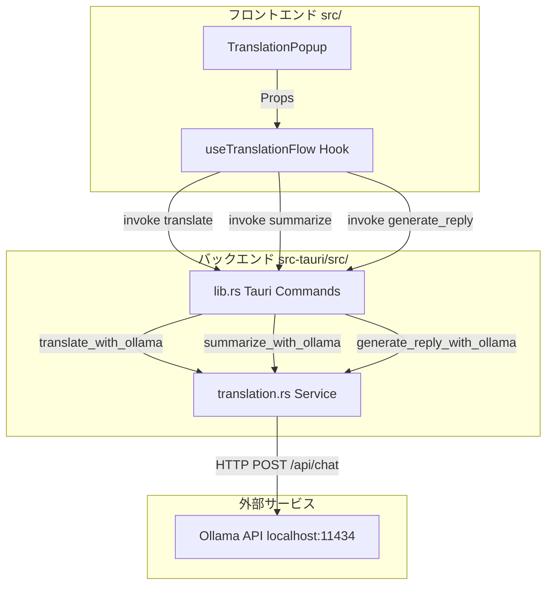
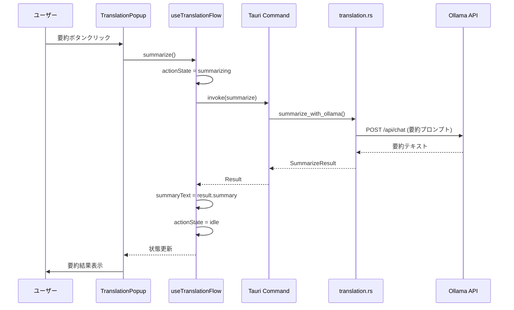

# Technical Design Document

## Overview

本機能は、既存の翻訳ポップアップに要約・返信作成機能を追加し、ユーザーが翻訳後すぐに追加の文章処理を実行できるようにします。翻訳完了後、ポップアップ内に「要約」「返信作成」ボタンを表示し、翻訳先言語で要約や丁寧な返信を生成します。

**Users**: 開発者、翻訳作業を行うユーザー、ビジネス文書を扱うユーザーがこの機能を利用し、翻訳結果を即座に要約したり返信案を作成したりできます。

**Impact**: 既存の翻訳フローを拡張し、コピー&ペーストの手間を削減します。翻訳、要約、返信作成をワンストップで実行可能になります。

### Goals
- 翻訳完了後、翻訳結果を直接要約できる
- 翻訳結果から丁寧なビジネス返信を自動生成できる
- 既存の翻訳フローを壊さず、自然に拡張する

### Non-Goals
- 要約・返信のカスタマイズ機能（トーン変更、長さ指定など）は将来の拡張として除外
- 複数言語ペア（日英以外）の対応は現時点では除外
- ストリーミング表示は要約・返信では未実装

## Architecture

### Existing Architecture Analysis

現在のHonnyakuアプリケーションは、Tauri v2ベースのハイブリッドアーキテクチャで、以下の構造を持ちます：

- **フロントエンド（React/TypeScript）**: `src/components/`にUIコンポーネント、`src/hooks/`にビジネスロジック
- **バックエンド（Rust）**: `src-tauri/src/services/`にOllama統合、`lib.rs`にTauriコマンド定義
- **翻訳フロー**: `useTranslationFlow`フックが翻訳状態を管理し、`TranslationPopup`コンポーネントがUIを表示
- **Tauri IPC**: フロントエンドは`invoke()`でバックエンドのコマンドを呼び出す

本機能はこの既存構造を拡張し、翻訳フローに要約・返信機能を追加します。

### Architecture Pattern & Boundary Map



**Architecture Integration**:
- **Selected pattern**: 既存のレイヤードアーキテクチャを維持（UI → Hooks → Tauri IPC → Services → External API）
- **Domain/feature boundaries**: 翻訳フロー（Translation Flow）ドメイン内に要約・返信機能を追加。UIとビジネスロジックは分離
- **Existing patterns preserved**: Tauri IPCコマンドパターン、React Hooksパターン、Ollama統合パターン
- **New components rationale**: 要約・返信は翻訳の後続処理であり、既存コンポーネントを拡張することで一貫性を保つ
- **Steering compliance**: Single Responsibility、Type Safety、Separation of Concernsの原則を維持

### Technology Stack

| Layer | Choice / Version | Role in Feature | Notes |
|-------|------------------|-----------------|-------|
| Frontend | React 18 + TypeScript 5 | 要約・返信ボタンと結果表示UI | 既存スタックを継承 |
| Frontend | Tailwind CSS 4 | 色分けスタイル（紫/緑） | 既存のユーティリティクラスを使用 |
| Backend | Rust 1.77+ | 要約・返信Tauriコマンド実装 | 既存のtranslation.rsを拡張 |
| Backend | reqwest 0.11+ | Ollama HTTPクライアント | 既存のHTTP_CLIENTを再利用 |
| Backend | tokio | 非同期ランタイム | 既存の非同期パターンを継承 |
| External | Ollama API | 要約・返信テキスト生成 | /api/chatエンドポイントを使用 |

## System Flows

### 要約フロー



**Key Decisions**:
- 要約処理中は`actionState`を`summarizing`に設定し、ボタンを非活性化
- エラー時は`actionError`に設定し、ユーザーに通知
- 翻訳先言語（`targetLanguage`）を使用してプロンプトを構築

### 返信作成フロー

返信作成フローは要約フローと同様ですが、`generate_reply`コマンドと`generating-reply`状態を使用します。

## Requirements Traceability

| Requirement | Summary | Components | Interfaces | Flows |
|-------------|---------|------------|------------|-------|
| 1.1, 1.2, 1.3, 1.4 | 要約ボタン表示 | TranslationPopup, useTranslationFlow | TranslationPopupProps | - |
| 2.1, 2.2, 2.3, 2.4, 2.5 | 返信作成ボタン表示 | TranslationPopup, useTranslationFlow | TranslationPopupProps | - |
| 3.1, 3.2, 3.3, 3.4, 3.5, 3.6 | 要約機能実行 | useTranslationFlow, summarize Tauri Command, translation.rs | SummarizeResult, summarize() | 要約フロー |
| 4.1, 4.2, 4.3, 4.4, 4.5, 4.6, 4.7 | 返信作成実行 | useTranslationFlow, generate_reply Tauri Command, translation.rs | ReplyResult, generate_reply() | 返信作成フロー |
| 5.1, 5.2, 5.3, 5.4, 5.5, 5.6 | バックエンドAPI | summarize/generate_reply Tauri Commands, translation.rs | SummarizeResult, ReplyResult | - |
| 6.1, 6.2, 6.3 | 状態管理とリセット | useTranslationFlow | reset() | - |
| 7.1, 7.2, 7.3 | 同時実行制御 | useTranslationFlow | actionState | - |
| 8.1, 8.2, 8.3, 8.4, 8.5 | UIレイアウト | TranslationPopup | - | - |

## Components and Interfaces

### Summary

| Component | Domain/Layer | Intent | Req Coverage | Key Dependencies | Contracts |
|-----------|--------------|--------|--------------|------------------|-----------|
| TranslationPopup | UI / Components | 要約・返信ボタンと結果表示UI | 1, 2, 8 | useTranslationFlow (P0) | State |
| useTranslationFlow | Logic / Hooks | 要約・返信状態管理とTauri IPC呼び出し | 3, 4, 6, 7 | Tauri invoke (P0) | Service |
| summarize Command | Backend / Tauri IPC | 要約APIエンドポイント | 5 | translation.rs (P0) | API |
| generate_reply Command | Backend / Tauri IPC | 返信生成APIエンドポイント | 5 | translation.rs (P0) | API |
| translation.rs | Backend / Service | Ollama統合とプロンプト構築 | 3, 4, 5 | Ollama API (P0) | Service |

### Frontend / UI Layer

#### TranslationPopup

| Field | Detail |
|-------|--------|
| Intent | 翻訳ポップアップに要約・返信ボタンと結果表示エリアを追加 |
| Requirements | 1.1, 1.2, 1.3, 1.4, 2.1, 2.2, 2.3, 2.4, 2.5, 8.1, 8.2, 8.3, 8.4, 8.5 |

**Responsibilities & Constraints**
- 翻訳完了時に要約・返信ボタンを表示
- ボタンクリック時に親フックの関数を呼び出し
- 要約・返信結果を色分けして表示
- 処理中はスピナーとテキストでローディング状態を表示

**Dependencies**
- Inbound: useTranslationFlow — 状態とコールバック関数 (P0)
- Outbound: CopyButton — コピー機能 (P1)

**Contracts**: State [X]

##### State Management

```typescript
interface TranslationPopupProps {
  // 既存のprops
  state: TranslationFlowState;
  originalText: string;
  translatedText: string | null;
  error: TranslationFlowError | null;
  durationMs?: number | null;
  onClose: () => void | Promise<void>;
  onCopy?: (text: string) => void;

  // 新規追加props
  actionState?: 'idle' | 'summarizing' | 'generating-reply';
  summaryText?: string | null;
  replyText?: string | null;
  actionError?: string | null;
  onSummarize?: () => void | Promise<void>;
  onGenerateReply?: () => void | Promise<void>;
}
```

**Implementation Notes**
- **Integration**: `state === 'completed'`時にボタンと結果エリアを条件レンダリング
- **Validation**: `actionState !== 'idle'`時はボタンを非活性化
- **Risks**: ポップアップ高さが画面を超える可能性 → `max-h`と`overflow-y-auto`で対応

### Frontend / Logic Layer

#### useTranslationFlow

| Field | Detail |
|-------|--------|
| Intent | 翻訳フローに要約・返信状態を追加し、Tauri IPCを呼び出す |
| Requirements | 3.1, 3.2, 3.3, 3.4, 3.5, 3.6, 4.1, 4.2, 4.3, 4.4, 4.5, 4.6, 4.7, 6.1, 6.2, 6.3, 7.1, 7.2, 7.3 |

**Responsibilities & Constraints**
- 要約・返信の状態管理（`actionState`, `summaryText`, `replyText`, `actionError`）
- 翻訳先言語（`targetLanguage`）の保持
- Tauri IPCコマンド（`summarize`, `generate_reply`）の呼び出し
- リセット時に要約・返信状態もクリア
- 同時実行制御（`actionState`チェック）

**Dependencies**
- Outbound: Tauri invoke — summarize, generate_reply (P0)

**Contracts**: Service [X]

##### Service Interface

```typescript
interface UseTranslationFlowReturn {
  // 既存の戻り値
  state: TranslationFlowState;
  originalText: string;
  translatedText: string | null;
  error: TranslationFlowError | null;
  durationMs: number | null;
  isShortcutEnabled: boolean;
  startFlow: () => Promise<void>;
  reset: () => Promise<void>;
  setShortcutEnabled: (enabled: boolean) => void;

  // 新規追加の戻り値
  actionState: 'idle' | 'summarizing' | 'generating-reply';
  summaryText: string | null;
  replyText: string | null;
  actionError: string | null;
  targetLanguage: Language | null;
  summarize: () => Promise<void>;
  generateReply: () => Promise<void>;
}
```

**Preconditions**:
- `summarize()`実行時: `translatedText !== null`, `targetLanguage !== null`, `actionState === 'idle'`
- `generateReply()`実行時: `translatedText !== null`, `targetLanguage !== null`, `actionState === 'idle'`

**Postconditions**:
- 成功時: `summaryText` または `replyText`が設定され、`actionState === 'idle'`
- 失敗時: `actionError`が設定され、`actionState === 'idle'`

**Invariants**:
- `actionState`は`'idle'`, `'summarizing'`, `'generating-reply'`のいずれか
- `actionState !== 'idle'`の間、`summarize()`と`generateReply()`は実行されない

**Implementation Notes**
- **Integration**: `translateText()`関数内で`setTargetLanguage(targetLang)`を呼び出し、翻訳先言語を保持
- **Validation**: `actionState`チェックで同時実行を防止
- **Risks**: フックが大きくなる → 500行を超えたら分割を検討

### Backend / Tauri IPC Layer

#### summarize Command

| Field | Detail |
|-------|--------|
| Intent | フロントエンドから要約リクエストを受け取り、結果を返す |
| Requirements | 5.1, 5.3, 5.5, 5.6 |

**Responsibilities & Constraints**
- テキストと言語を受け取る
- 設定からOllamaエンドポイントとモデルを取得
- `translation::summarize_with_ollama()`を呼び出す
- 結果を返す

**Dependencies**
- Inbound: フロントエンド invoke — リクエスト (P0)
- Outbound: translation.rs — summarize_with_ollama (P0)

**Contracts**: API [X]

##### API Contract

| Method | Endpoint | Request | Response | Errors |
|--------|----------|---------|----------|--------|
| Tauri Command | summarize | `{ text: string, language: Language }` | SummarizeResult | TranslationError |

```typescript
// Request
interface SummarizeRequest {
  text: string;
  language: 'Japanese' | 'English';
}

// Response
interface SummarizeResult {
  summary: string;
  originalLength: number;
  summaryLength: number;
  durationMs: number;
}
```

#### generate_reply Command

| Field | Detail |
|-------|--------|
| Intent | フロントエンドから返信生成リクエストを受け取り、結果を返す |
| Requirements | 5.2, 5.4, 5.5, 5.6 |

**Responsibilities & Constraints**
- テキストと言語を受け取る
- 設定からOllamaエンドポイントとモデルを取得
- `translation::generate_reply_with_ollama()`を呼び出す
- 結果を返す

**Dependencies**
- Inbound: フロントエンド invoke — リクエスト (P0)
- Outbound: translation.rs — generate_reply_with_ollama (P0)

**Contracts**: API [X]

##### API Contract

| Method | Endpoint | Request | Response | Errors |
|--------|----------|---------|----------|--------|
| Tauri Command | generate_reply | `{ originalText: string, language: Language }` | ReplyResult | TranslationError |

```typescript
// Request
interface GenerateReplyRequest {
  originalText: string;
  language: 'Japanese' | 'English';
}

// Response
interface ReplyResult {
  reply: string;
  language: 'Japanese' | 'English';
  durationMs: number;
}
```

### Backend / Service Layer

#### translation.rs

| Field | Detail |
|-------|--------|
| Intent | Ollama API統合と要約・返信プロンプト構築 |
| Requirements | 3.1, 3.2, 4.1, 4.2, 4.3, 5.3, 5.4, 5.5, 5.6 |

**Responsibilities & Constraints**
- 要約・返信プロンプトの構築（言語別）
- Ollama APIへのHTTPリクエスト
- エラーハンドリングとタイムアウト管理
- 処理時間の計測

**Dependencies**
- Outbound: reqwest — HTTP POST (P0)
- External: Ollama API — /api/chat エンドポイント (P0)

**Contracts**: Service [X]

##### Service Interface

```rust
// 要約結果型
pub struct SummarizeResult {
    pub summary: String,
    pub original_length: usize,
    pub summary_length: usize,
    pub duration_ms: u64,
}

// 返信結果型
pub struct ReplyResult {
    pub reply: String,
    pub language: Language,
    pub duration_ms: u64,
}

// 要約関数
pub async fn summarize_with_ollama(
    text: &str,
    language: Language,
    endpoint: &str,
    model: &str,
) -> Result<SummarizeResult, TranslationError>;

// 返信生成関数
pub async fn generate_reply_with_ollama(
    text: &str,
    language: Language,
    endpoint: &str,
    model: &str,
) -> Result<ReplyResult, TranslationError>;

// プロンプト構築関数
fn build_summarize_prompt(text: &str, language: Language) -> String;
fn build_reply_prompt(text: &str, language: Language) -> String;
```

**Preconditions**:
- `text`は空文字列ではない
- `endpoint`は有効なURL
- `model`は存在するモデル名

**Postconditions**:
- 成功時: `summary` または `reply`が生成され、`duration_ms`が計測される
- 失敗時: 適切な`TranslationError`が返される

**Invariants**:
- HTTPクライアントはグローバルインスタンス（`HTTP_CLIENT`）を再利用
- タイムアウトは60秒

**Implementation Notes**
- **Integration**: 既存の`translate_with_ollama()`と同じパターンでHTTPリクエストを実行
- **Validation**: Ollama APIレスポンスを検証し、エラーをマッピング
- **Risks**: 長文での要約・返信生成はタイムアウトの可能性 → エラーメッセージで再試行を促す

## Data Models

### Domain Model

**ActionState型**: 要約・返信処理の状態を表現

```typescript
type ActionState = 'idle' | 'summarizing' | 'generating-reply';
```

- `idle`: 処理なし
- `summarizing`: 要約中
- `generating-reply`: 返信生成中

**不変条件**: `actionState`は常にこの3つの値のいずれか

### Data Contracts & Integration

**Ollama API Chat Endpoint**:

```json
{
  "model": "qwen2.5:3b",
  "messages": [
    {
      "role": "user",
      "content": "<プロンプト>"
    }
  ],
  "stream": false,
  "options": {
    "temperature": 0.2,
    "repeat_penalty": 1.1
  },
  "keep_alive": "10m"
}
```

**要約プロンプト例（日本語）**:
```
以下のテキストを簡潔に要約してください。要約のみを出力し、説明は不要です。

<テキスト>
```

**返信プロンプト例（英語）**:
```
Create a polite business reply to the following text. Output only the reply text.

<テキスト>
```

## Error Handling

### Error Strategy

要約・返信機能のエラーは、既存の翻訳エラーハンドリングと同じパターンを使用します。

### Error Categories and Responses

**User Errors**:
- テキストが選択されていない → フロントエンドで事前チェック（`translatedText === null`）

**System Errors**:
- Ollama未起動 → `TranslationError::ConnectionFailed` → "Ollamaが起動していません。Ollamaを起動してください。"
- タイムアウト → `TranslationError::Timeout` → "リクエストがタイムアウトしました"
- APIエラー → `TranslationError::ApiError` → バックエンドからのエラーメッセージ

**Business Logic Errors**:
- 同時実行試行 → フロントエンドで事前チェック（`actionState !== 'idle'`）

### Monitoring

- エラーは`console.error`でログ出力
- `actionError`状態でユーザーに通知
- 将来的にはエラー頻度をメトリクスとして収集

## Testing Strategy

### Unit Tests
- `build_summarize_prompt()`: 日本語/英語プロンプトの構築を検証
- `build_reply_prompt()`: 日本語/英語プロンプトの構築を検証
- `SummarizeResult`, `ReplyResult`: シリアライゼーションを検証
- `useTranslationFlow.summarize()`: 状態遷移とTauri invokeを検証（モック使用）
- `useTranslationFlow.generateReply()`: 状態遷移とTauri invokeを検証（モック使用）

### Integration Tests
- 要約フロー: ボタンクリック → Tauri IPC → Ollama API → 結果表示
- 返信フロー: ボタンクリック → Tauri IPC → Ollama API → 結果表示
- エラーハンドリング: Ollama未起動時のエラー表示
- 同時実行制御: 要約中に返信ボタンがクリックされても処理されないことを検証

### E2E/UI Tests
- 翻訳完了後、要約ボタンが表示されることを検証
- 要約ボタンをクリックし、要約結果が紫色エリアに表示されることを検証
- 返信作成ボタンをクリックし、返信結果が緑色エリアに表示されることを検証
- コピーボタンで要約・返信結果をクリップボードにコピーできることを検証
- Escキーでポップアップを閉じ、再度翻訳実行時に前回の結果が表示されないことを検証

## Optional Sections

### Performance & Scalability

**Target Metrics**:
- 要約生成時間: 5秒以内（短文〜中文）
- 返信生成時間: 5秒以内（短文〜中文）
- UI応答性: ボタンクリック後100ms以内にローディング状態表示

**Optimization Techniques**:
- Ollamaモデルのプリロード（既存機能）を活用
- HTTPクライアントのコネクションプーリング（既存実装）を再利用

**Scalability Considerations**:
- 長文（1000文字以上）の要約・返信は処理時間が増加する可能性 → タイムアウト処理でカバー
- 並行リクエストは同時実行制御（`actionState`）で防止
